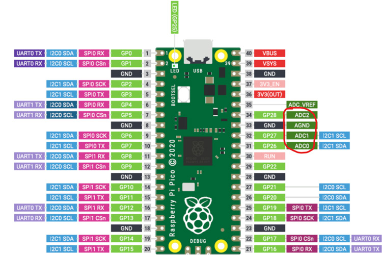

### Setup
<hr>
The link below will get you up to speed in installing and setting up micripython on the pico

[Installing Micropython](https://www.raspberrypi.com/documentation/microcontrollers/)

### Pinout
<hr>



1. Dual-Core ARM Cortex-M0+
2. Clock speed 48MHz, Boost to 133MHz
3. 8 ground pins
4. 26 GPIOs
5. Internal for LED
6. 12-bit ADC
7. 3 ADCs, Internal ADC for temperature
8. 2 I2C buses
9. 2 SPI buses
10. 2 UART Buses
11. 16 PWM channels

### Powering
<hr>

1. Can operate as normal MCU 
2. Can be powered using micro-USB  
3. Battery powering

### Programming
<hr>

Pico can be programmed using Micropython or C++. The link below has additional information.
[Set up Thonny IDE to use with the Raspberry Pi Pico](https://projects.raspberrypi.org/en/projects/getting-started-with-the-pico/2)

Pico uses 3.3V logic and it has 26 GPIO pins with PWM. It has also internal pull up resistors to reduce the circuitry needed.

#### 1. Blink 
```python
import machine
import utime

led_pin = machine.Pin(10, machine.Pin.OUT)

while True:
    led_pin.value(1)
    utime.sleep_ms(500)
    led_pin.value(0)
    utime.sleep(500)


```

#### 2. Push button without debounce
```python
import machine
import utime

btn = machine.Pin(11, machine.Pin.IN, machine.Pin.PULL_DOWN)
# pull down to hold the button low all the time unless when it is pressed

while True:
    if btn.value() == 1:
        print("pressed")
        
    utime.sleep_ms(300)

```

### More examples
1. [Led toggle](./examples/toggle.py)
2. [I2C](./examples/i2c.py)
3. [Reading voltage with potentiometer](./examples/potentiometer.py)
4. [PWM](./examples/pwm.py)
5. [Controlling LED brighness with PWM and potentiometer](./examples/pwm_with_potentiometer.py)
6. [Push button without debounce](./examples/push_btn_no_debounce.py)
6. [LED blink](./examples/blink.py)

